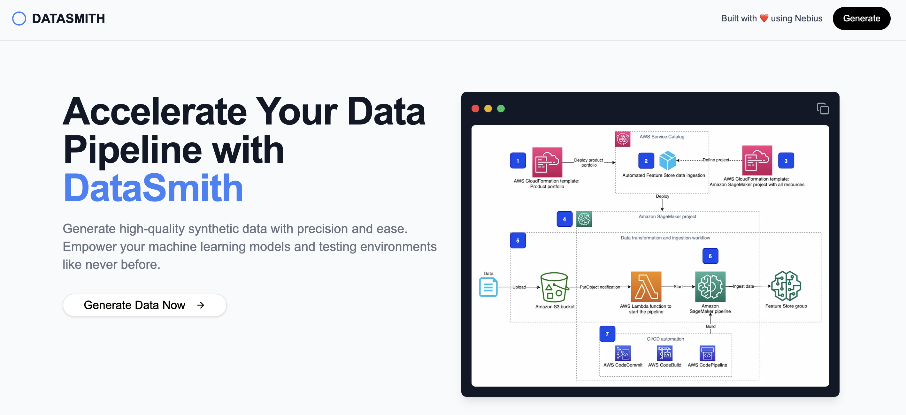

# DATASMITH 🚀

Built with ❤️ using [Nebius](https://nebius.com/studio/inference?utm_medium=cpc&utm_source=dataSmith&utm_campaign=Network_en_all_lgen_inference_cloud&utm_term=dataSmith)

---

**DATASMITH** is your ultimate tool for synthetic data generation! With the power of open-source AI models and a user-friendly interface, you can generate high-quality data for machine learning, testing, and beyond in just a few clicks.

---

## 🌟 Key Features

### 🔥 **Generate Synthetic Data Effortlessly**
Describe your data requirements in natural language or JSON schema, and let **DataSmith** do the rest. No more manual creation—focus on using the data, not making it.

### ⚡ **Scale Quickly**
Generate data at scale using powerful open-source AI models like **Qwen**, **Llama**, and others. Whether you need a few records or millions, **DataSmith** has you covered.

---

## 🌐 Leverage Open Source

- **Cutting-Edge Models**: Utilize models like **Qwen-2.5-Coder-32B**, offering state-of-the-art performance for synthetic data generation.
- **Accessible to Everyone**: Open source and ready for developers, researchers, and enterprises alike.

---

## 🎨 Experiment Freely
Harness the **Nebius AI Studio** to experiment with models at a **low cost**. Test diverse scenarios, handle imbalanced datasets, and ensure data quality with ease.

🔗 Learn more about Nebius AI Studio [here](https://nebius.com/studio/inference?utm_medium=cpc&utm_source=dataSmith&utm_campaign=Network_en_all_lgen_inference_cloud&utm_term=dataSmith).

---

## 💡 Want to Replicate This App?
The **DataSmith** project is open source!
You can clone the repository and deploy it easily to **Vercel** or your preferred platform.

### 🚀 View the Code on GitHub
- [Clone the repository](https://github.com/fsndzomga/datasmith) and start generating your own synthetic data today!

---

### ✨ Build Smarter with DataSmith!
Empower your machine learning workflows and application testing with high-quality synthetic data, all backed by **Nebius** and open-source innovation.

---

### 📜 License

This project is licensed under the MIT License.
